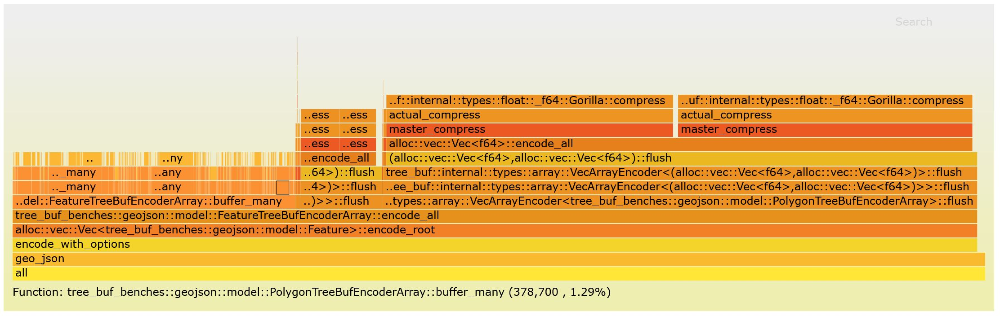
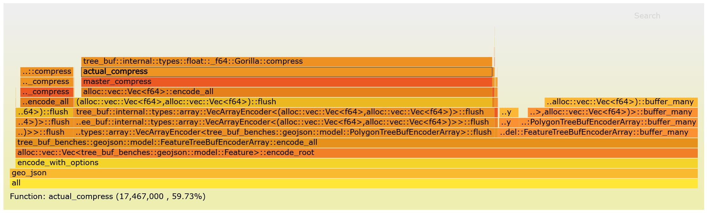
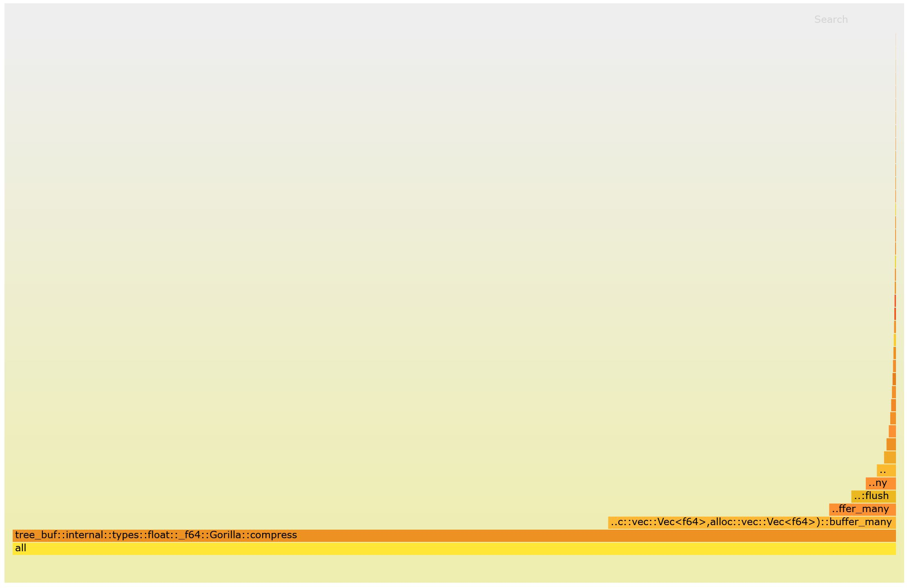

Firestorm is the low-overhead intrusive flamegraph profiler for Rust.

[Tenets](#tenets-of-the-design) of the design

For instrumenting start [here](#instrumenting).

For profiling start [here](#profiling).

Firestorm uses `inferno` under the hood for displaying the flamegraphs. Firestorm would not be possible without their contribution.

<br>

# Tenets of the design
Firestorm is performance. When you are writing a library that is the fastest in its class, you need a profiler that has the same ideals. When Firestorm is not enabled (the default) all invocations compile down to a no-op. When Firestorm is enabled, it makes no heap allocations and avoids as much work as possible in the critical section. 

Firestorm is ubiquitous. When Firestorm is enabled by the application layer for profiling, it is enabled for all dependencies - transitively. This happens without needing to add feature flags to libraries or even be aware which libraries use Firestorm. By avoiding making Firestorm a part of a library's public API, combined with the fact that Firestorm compiles down to a no-op when not used... adding Firestorm to a library should be a no-brainer. This is good because applications benefit as more libraries adopt Firestorm.

Firestorm is insight. After profiling, Firestorm offers three different ways to view the data - each looking at the performance of the run from a different angle.

<br>

# Instrumenting

First, add Firestorm to your dependencies in Cargo.toml:

```toml
[dependencies]
firestorm = "0.4"
```

Then, import Firestorm's profiling macros. I recommend doing this in a crate `prelude` module.

```rust
pub(crate) use firestorm::{
    profile_fn,
    profile_method,
    profile_section
};
```

Lastly, invoke the macros in your functions.

```rust
fn fn_name<T>(param: T) {
    // You can optionally add generic parameters
    profile_function!(T, fn_name);

    // If a function is complex, profile a section.
    {
        profile_section!(inner);

        // Optional: manually drop.
        // Section automatically drops when going out of scope.
        drop(inner);
    }
}

fn method_name(&self) {
    // profile_method automatically captures the type of Self
    profile_method!(method_name);
}
```

Important tips for instrumenting libraries:
 * Do NOT target an exact version of Firestorm. Eg: Do not use `firestorm = "=0.4.1"`. Use `firestorm = "0.4.1"` instead. This is an important part of Firestorm's backward compatibility policy. If `firestorm-core` needs to be updated, all major versions will receive a patch so that all versions of Firestorm are enabled. Targeting a specific version may prevent libraries from sharing the `firestorm-core` dependency or being enabled transitively.
 * Do NOT put firestorm in `[dev-dependencies]`. Always put firestorm in `[dependencies]`.
 * Do NOT enable any firestorm features in your library code, such as `enable_system_time`. Doing so would prevent Firestorm from compiling down to a no-op when not in use.
 * Do NOT hide the use of Firestorm behind a feature flags or `[cfg()]`. Firestorm should always be in use and does not affect compile time or performance unless enabled.

<br>

# Profiling

To enable profiling, Firestorm needs an additional feature specified in `Cargo.toml`:

```toml
[dependencies]
firestorm = { version="0.4", features=["enable_system_time"] }
```

Run the bench and save the result:

```rust
// Do a warmup. This will pre-allocate
// memory needed for sampling with Firestorm.
bench();
// Clear samples taken during warmup.
firestorm::clear();
// Run the bench for real.
bench();
// Save the data. Make sure this is an empty
// directory so that no important files are overwritten.
firestorm::save("./").unwrap();
// Maybe Firestorm should put this pattern in a
// utility function in the next minor release.
```

After running the above, there will be a `firestorm.html` in the target directory and a `/firestorm` subdirectory with supporting files. Open `firestorm.html` to view the results.

There are three output flamegraphs to aggregate the data in different ways. The dropdown on the top-left switches modes.

### Time-Axis



This mode displays a separate bar for each invocation of every function. It's called "Time-Axis" because the data is as-if the y axis is time. This is especially useful if you want to differentiate between many short calls to a function vs one long call. This has the most information but can be a bit noisy.

### Merged



This mode displays one bar for each path through the callstack. Multiple invocations can be displayed in a single bar. This aggregates more information. Like the Time-Axis mode, the width of a bar represents the function's total time - including both own-time and called function times.

### Own-Time



This mode displays each function's own time as a sideways bar graph regardless of what it was called by. The ordering is the most time expended at the bottom, and the "stack" has nothing to do with which function calls the others. Unfortunately our flamegraph dependency doesn't understand this, so just ignore that part. Firestorm should improve the display method here but it's too useful to leave out of this first version for that.
